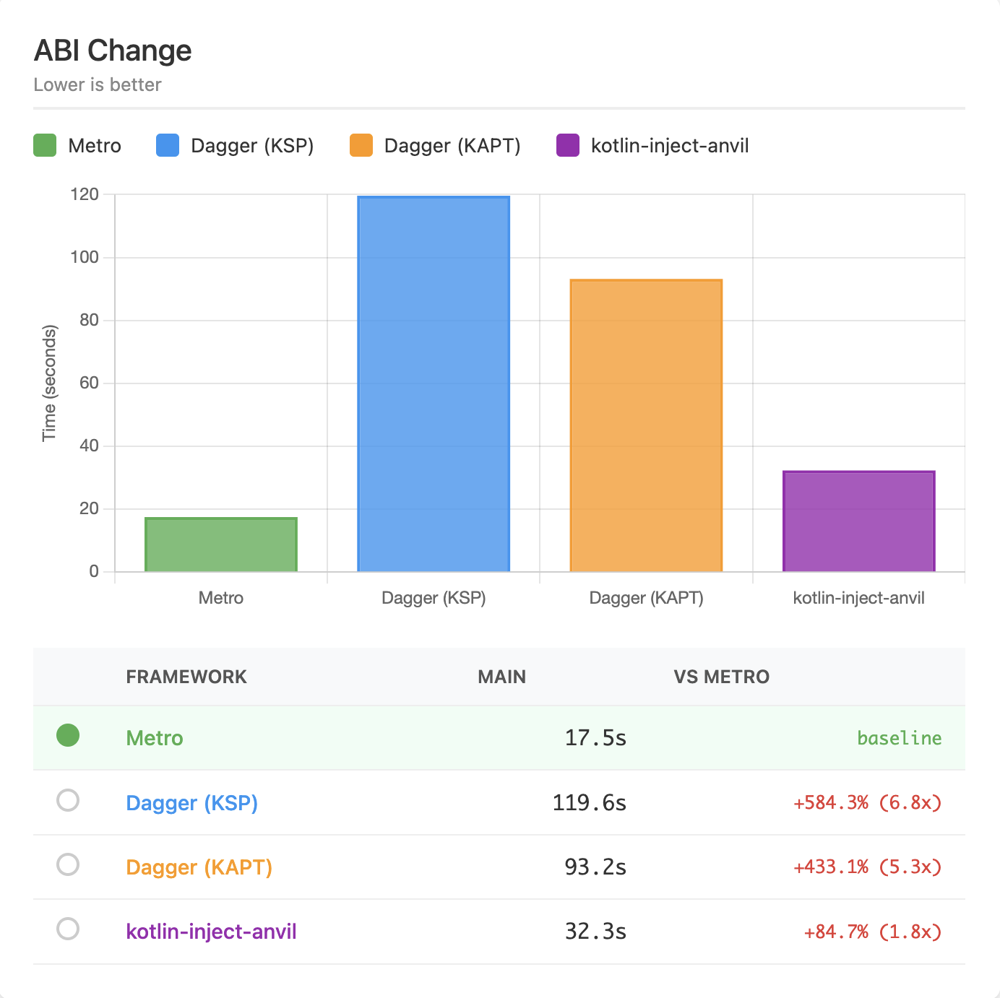
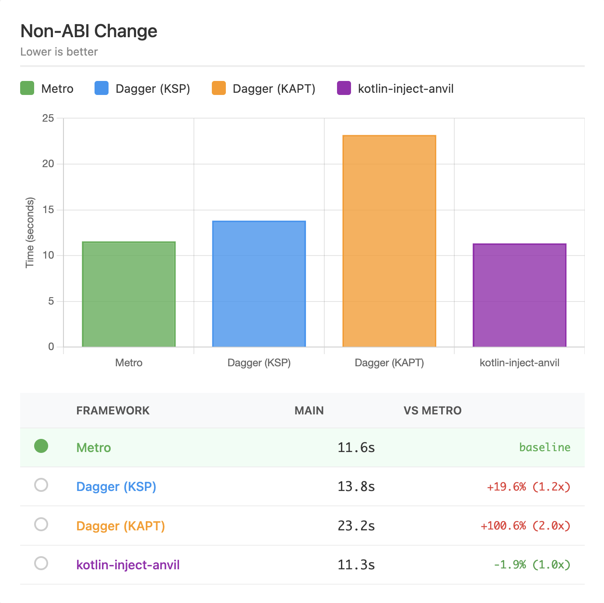
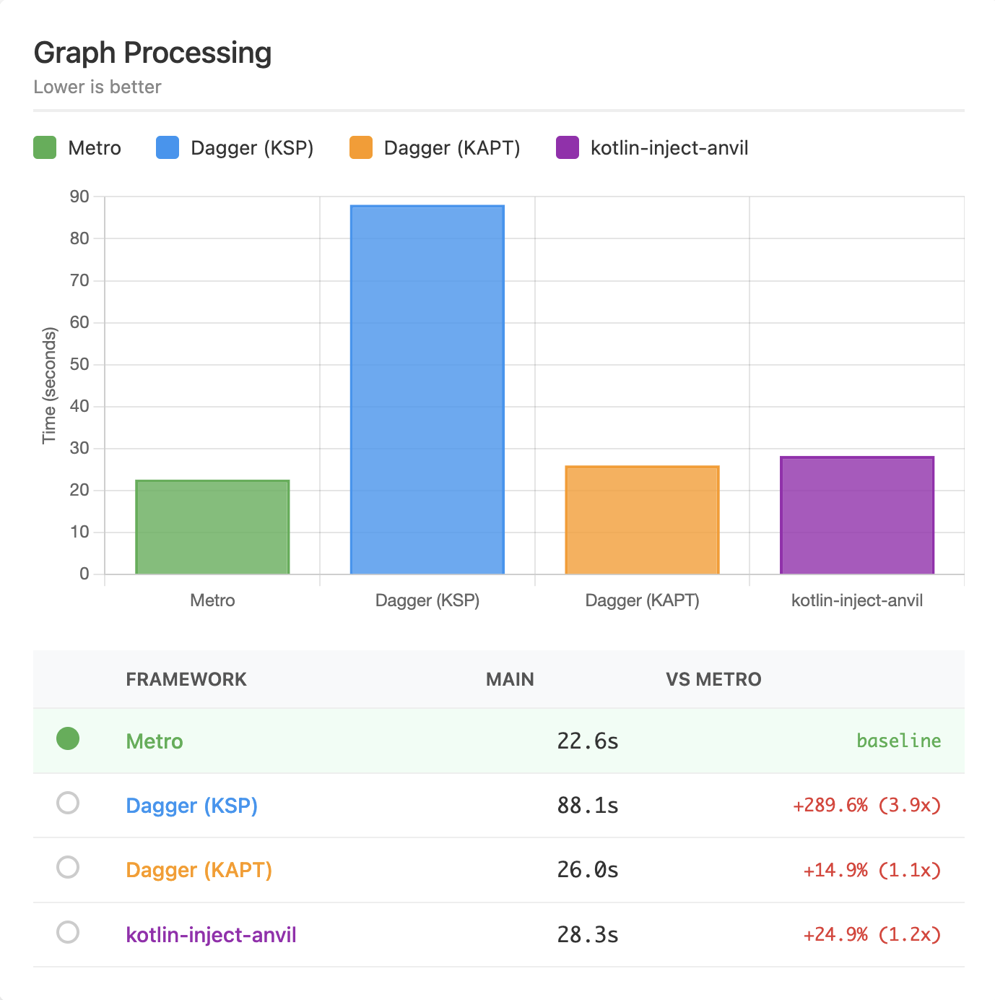
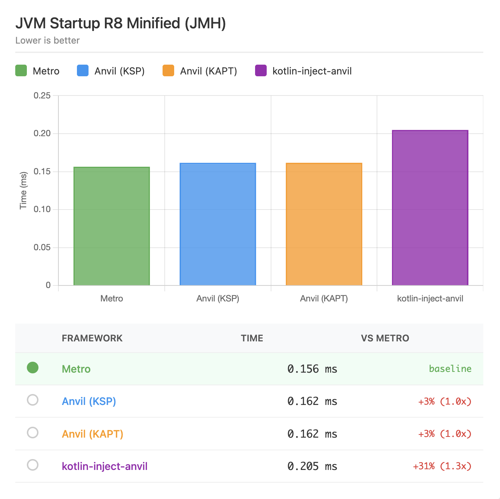
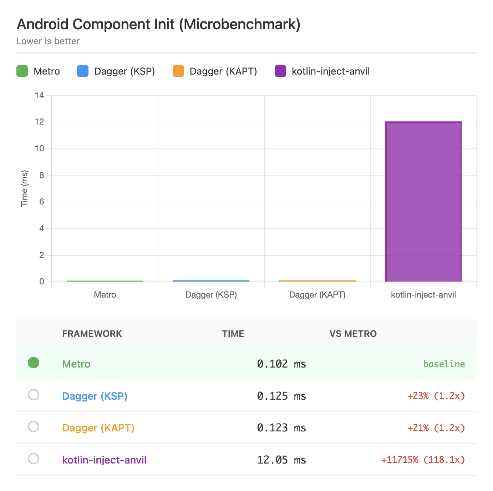

# Performance

Metro strives to be a performant solution with minimal overhead at build-time and generating fast, efficient code at runtime.

## Benchmarks

To benchmark against anvil-ksp + dagger-ksp, anvil-ksp + dagger-kapt, and kotlin-inject-anvil + kotlin-inject, there is a [benchmark](https://github.com/ZacSweers/metro/tree/main/benchmark) directory with a generator script. There are more details in its README, but in short it generates a nontrivial multi-module project (default is 500 modules but is configurable) and benchmarks with gradle-profiler.

The below sections describe the two scenarios Metro's benchmarks run against using this project generation.

**Modes**

- `Metro`: Purely running metro
- `Dagger (KSP)`: Running dagger-ksp with anvil-ksp for contribution merging.
- `Dagger (KAPT)`: Running dagger-kapt with anvil-ksp for contribution merging.
- `Kotlin-Inject`: Running kotlin-inject with kotlin-inject-anvil for contribution merging.

### Build Performance

Metro's compiler plugin is designed to be _fast_. Running as a compiler plugin allows it to:
- Avoid generating new sources that need to be compiled
- Avoid running KSP/KAPT
- Generate IR that lowers directly into target platforms
- Hook directly into kotlinc's IC APIs.

**In a straightforward migration, it improves ABI-changing build performance by 80-85%.**

#### Methodology

This benchmark uses [gradle-profiler](https://github.com/gradle/gradle-profiler) to benchmark build performance using different tools.

!!! tip "Summary"
    Results as of Metro `0.8.3`, Anvil-KSP `0.5.1`, Dagger `2.57.2`, and Kotlin-Inject `0.8.0` with kotlin-inject-anvil `0.1.6` are as follows.

    _(Median times in seconds)_

    |                      | Metro  | Dagger (KSP)   | Dagger (KAPT) | Kotlin-Inject |
    |----------------------|--------|----------------|---------------|---------------|
    | **ABI**              | 17.5s  | 119.6s (+584%) | 93.2s (+433%) | 32.3s (+85%)  |
    | **Non-ABI**          | 11.6s  | 13.8s (+20%)   | 23.2s (+100%) | 11.3s (-2%)   |
    | **Graph processing** | 22.6s  | 88.1s (+290%)  | 26.0s (+15%)  | 28.3s (+25%)  |

    View the [full interactive benchmark report](benchmark_assets/build-benchmark-report.html) for detailed results including environment information.

##### ABI Change

This benchmark makes ABI-breaking source changes in a lower level module. This is where Metro shines the most.



##### Non-ABI Change

This benchmark makes non-ABI-breaking source changes in a lower level module. The differences are less significant here as KSP is quite good at compilation avoidance now too. The outlier here is KAPT, which still has to run stub gen + apt and cannot fully avoid it.



##### Raw Graph/Component Processing

This benchmark reruns the top-level merging graph/component where all the downstream contributions are merged. This also builds the full dependency graph and any contributed graph extensions/subcomponents.

Metro again shines here. Dagger (KSP) seems to have a bottleneck that disproportionately affects it here too.



### Runtime Performance

Metro's compiler generates Dagger-style factory classes for every injection site. The same factory classes are reused across modules and downstream builds, so there's no duplicated glue code or runtime discovery cost.

Because the full dependency graph is wired at compile-time, each binding is accessed through a direct provider field reference or direct invocation in the generated code. No reflection, no hashmap lookups, no runtime service locator hops, etc.

#### Methodology

To measure and compare runtime performance, Metro benchmarks graph initialization time across different DI frameworks. These benchmarks measure the time to create and initialize a dependency graph with 500 modules' worth of bindings.

!!! note "Interactive Report"
    View the [full interactive benchmark report](benchmark_assets/startup-benchmark-report.html) for detailed results including environment information.

#### JVM Startup

These benchmarks run with JMH.

On the JVM, Metro, Dagger (KSP), and Dagger (KAPT) all perform nearly identically since they generate similar factory-based code. kotlin-inject is slightly slower due to its different code generation approach.


#### JVM Startup (R8 Minified)

These benchmarks run with JMH on an R8-minified jar of the same built project.

With R8 minification enabled, Metro shows a slight edge. The benefits of compile-time wiring become more apparent as R8 can further optimize the generated code.



#### Android Graph Init

On Android, the differences become more pronounced. Metro and Dagger perform similarly well, while kotlin-inject shows a significant performance gap.



## Real-World Results

Below are some results from real-world projects, shared with the developers' permission.

!!! note "Cash App"
    Cash App wrote a blog post about their migration to Metro: [Cash App Moves to Metro](https://code.cash.app/cash-android-moves-to-metro)

    > According to our benchmarks, by migrating to Metro and K2 we managed to improve clean build speeds by over 16% and incremental build speeds by almost 60%!

!!! note "Gabriel Ittner from Freeletics"
    I've got Metro working on our code base now using the Kotlin 2.2.0 preview
    
    Background numbers
    
    - 551 modules total
    - 105 modules using Anvil KSP ➡️ migrated to pure Metro
    - 154 modules using Anvil KSP + other KSP processor ➡️ Metro + other KSP processor
    - 1 module using Dagger KAPT ➡️ migrated to pure Metro
    
    Build performance
    
    - Clean builds without build cache are 12 percentage points faster
    - Any app module change ~50% faster (this is the one place that had kapt and it's mostly empty other than generating graphs/components)
    - ABI changes in other modules ~ 40% - 55% faster
    - non ABI changes in other modules unchanged or minimally faster

!!! note "Madis Pink from emulator.wtf"
    I got our monorepo migrated over from anvil, it sliced off one third of our Gradle tasks and `./gradlew classes` from clean is ~4x faster

!!! note "Kevin Chiu from BandLab"
    We migrated our main project at BandLab to metro, finally!
    
    Some context about our project:

    - We use Dagger + Anvil KSP
    - 929 modules, 89 of them are running Dagger compiler (KAPT) to process components
    - 7 KSP processors

    | Build                             | Dagger + Anvil KSP | Metro (Δ)              |
    |-----------------------------------|--------------------|------------------------|
    | UiKit ABI change (Incremental)    | 59.7 s             | 26.9 s (55% faster)   |
    | Root ABI change (Incremental)     | 95.7 s             | 48.1 s (49.8% faster) |
    | Root non-ABI change (Incremental) | 70.9 s             | 38.9 s (45.2% faster) |
    | Clean build                       | 327 s              | 288 s (11.7% faster)  |

!!! note "Cyril Mottier from Amo"
    [Ref](https://x.com/cyrilmottier/status/1971562605899546936)

    > We already had incremental compilation in the single-digit seconds range, but I’m still blown away by how much faster it is now that the entire codebase is fully on Metro. 🤯

## Reporting

If you want to investigate the performance of different stages of Metro's compiler pipeline, you can enable reporting in the Gradle DSL.

```kotlin
metro {
  reportsDestination.set(layout.buildDirectory.dir("metro/reports"))
}
```

Among the reports written there, there will also be a trace log that dumps a simple trace of the different stages.

```
[ExampleGraph] ▶ Transform dependency graph
  ▶ Build DependencyGraphNode
  ◀ Build DependencyGraphNode (xx ms)
  ▶ Implement creator functions
  ◀ Implement creator functions (xx ms)
  ▶ Build binding graph
  ◀ Build binding graph (xx ms)
  ▶ Validate binding graph
    ▶ Check self-cycles
    ◀ Check self-cycles (xx ms)
    ▶ Validate graph
      ▶ seal graph
        ▶ Populate bindings
        ◀ Populate bindings (xx ms)
        ▶ Build adjacency list
        ◀ Build adjacency list (xx ms)
        ▶ Sort and validate
          ▶ Topo sort
            ▶ Compute SCCs
            ◀ Compute SCCs (xx ms)
            ▶ Check for cycles
            ◀ Check for cycles (xx ms)
            ▶ Build component DAG
            ◀ Build component DAG (xx ms)
            ▶ Topo sort component DAG
            ◀ Topo sort component DAG (xx ms)
            ▶ Expand components
            ◀ Expand components (xx ms)
          ◀ Topo sort (xx ms)
        ◀ Sort and validate (xx ms)
        ▶ Compute binding indices
        ◀ Compute binding indices (xx ms)
      ◀ seal graph (xx ms)
      ▶ check empty multibindings
      ◀ check empty multibindings (xx ms)
      ▶ check for absent bindings
      ◀ check for absent bindings (xx ms)
    ◀ Validate graph (xx ms)
  ◀ Validate binding graph (xx ms)
  ▶ Transform metro graph
    ▶ Collect bindings
    ◀ Collect bindings (xx ms)
    ▶ Implement overrides
    ◀ Implement overrides (xx ms)
  ◀ Transform metro graph (xx ms)
[ExampleGraph] ◀ Transform dependency graph (xx ms)
```
